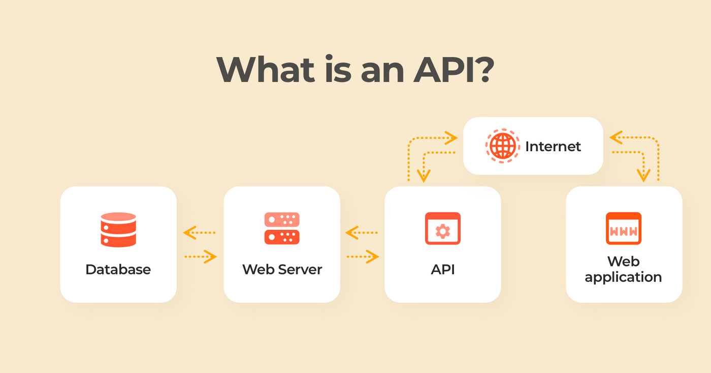
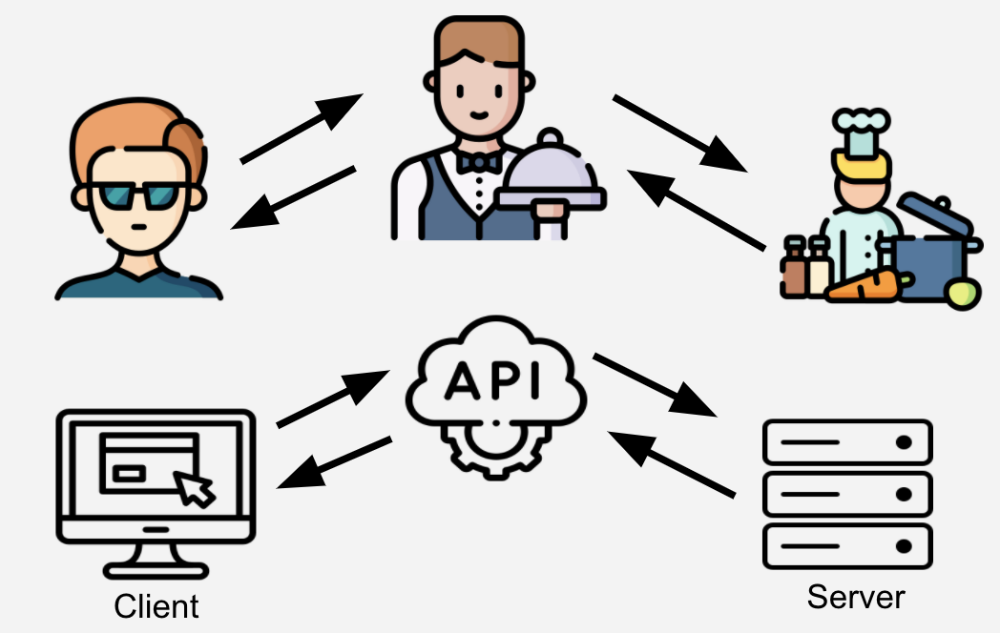

<strong>

# API: Application Programming Interfaces

- An API is a contract that allows code to talk to other code.
- They are building blocks of modern software because they allow for the sharing of resources across applications, organizations and devices.

## Why are APIs important ?

- APIs help developers integrate exciting features and build automations without reinventing the wheel.
- APIs aloows enterprises to open up their product for faster innovation.
- APIs can be product themselves.
- APIs is not just for developers even non-developer roles such as managers, architects, business and data analysts, educators and researchers also use them.
- Use of APIs is not only limited to Tech or IT Industries.

## APIs: Digital Restaurant

- API is like a waiter in the restaurant, serving as go-between for the customer and kitchen.
- A Customer who wants soup doesn't go the kitchen and cook, they need to know how to make the soup.
- The Only way is to ask the waiter for the soup.
- APIs work in the same way but different names for the players invovled. Instead of food/dish, the requester might ask for data or execution of a service.
  - Cusotmer -> Client (browser, web-app, mobile-app)
  - Waiter -> API (simplified Interface for interacting with the bakcend)
  - Kitchen -> Server (backend  where the processing happens)

## Types of APIs

### Medium

- Hardware APIs: Interface for software to talk to hardware
- Software Library APIs: Interface for directly consuming code from another code-base
- Web APIs: Interface for communicating across code bases over a network

### Architectures

- There is more than one way to  build and consume APIs. Some architecture types we may come across are:

  - REST(Representational State Transfer)
  - GraphQL
  - WebSockets
  - webhooks
  - SOAP (Simple Object Access Protocol)
  - gRPC (Google Remote Procedure Call)
  - MQTT (MQ Telemetry Transport)

> We will focus on REST APIs in this course since this is the most widely adopted API architecture.

REST APIs: Some traits of REST APIs include not storing session state between requests, the ability to cache, and ability to send and receive various data types.

### Accessibiltiy

- API also vary in the scope who can access them:

  - Public APIs (aka Open APIs): Consumed by anyone who discovers the API
  - Private APIs: Consumed only within an Organization and not made public
  - Partner APIs: Consumed between one or more organizations that have an establised relationship

## An API Platform

- Postman is an API platform for building and using APIs. Postman simplifies each step of the API lifecycle and streamlines collaboration so you can create better APIs faster, and consume them with ease.
- Before Postman, it was common practice to poke at APIs with a command line tool for making HTTP requests called cURL. This tool is still used today, but has its limitations when it comes to collaboration and sharing. 

</strong>

