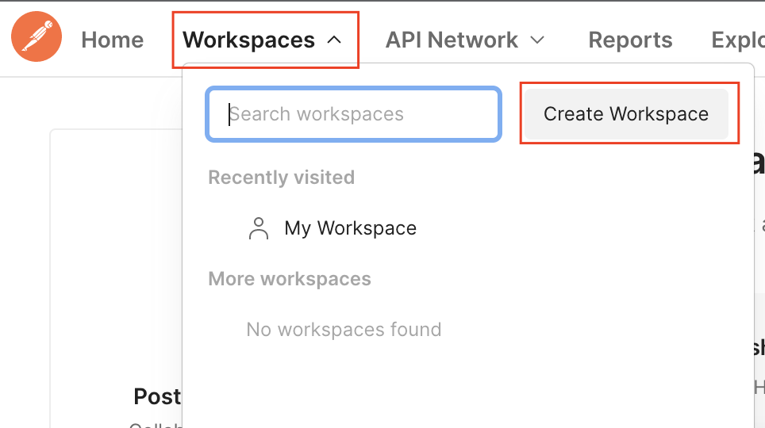
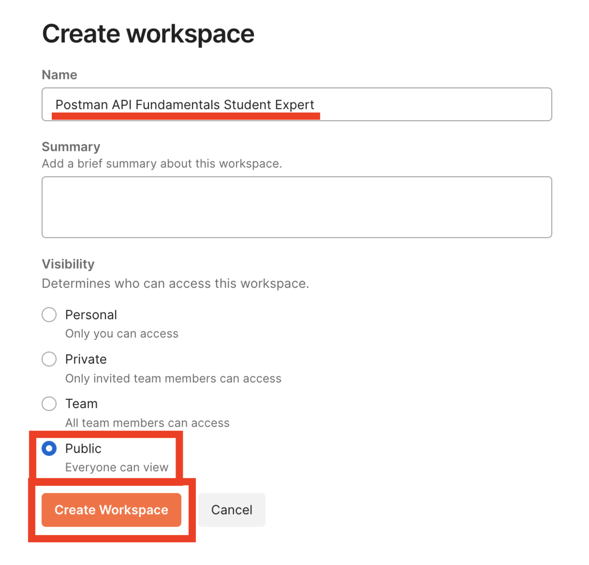

# Getting started with Postman

## Creating a Workspace

> This REST API allows you to CRUD (Create, Read, Update, Delete) books in a public library database. You will use Postman to interact with this API and manage books. 

- Workspaces dropdown > Create Workspace
 

 
- Name your workspace "Postman API Fundamentals Student Expert" and set the visibility to Public (or Personal if you cannot make a Public workspace on your team). Then click "Create Workspace"
  

  