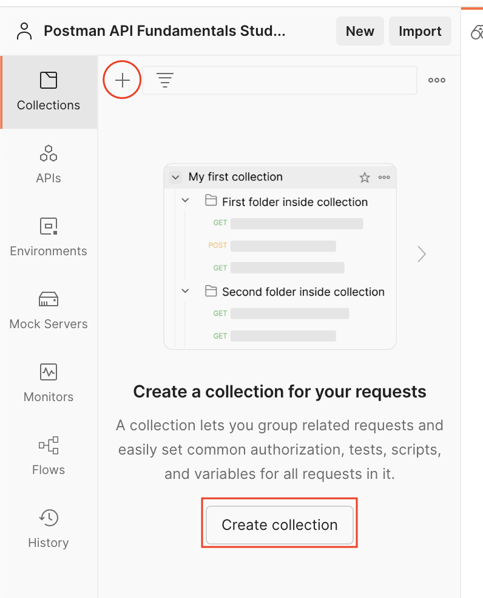
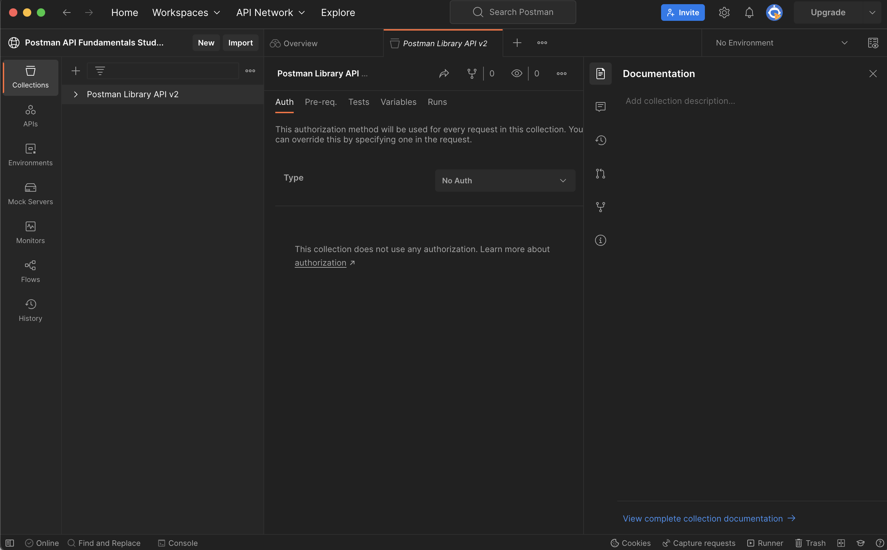
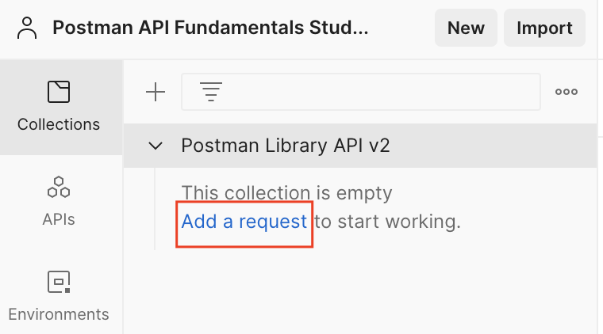
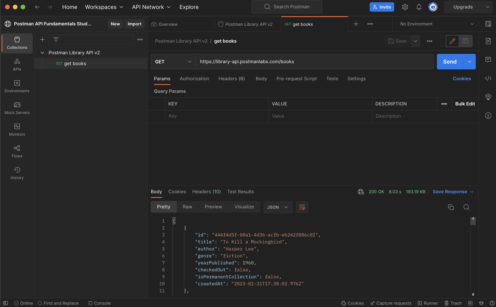
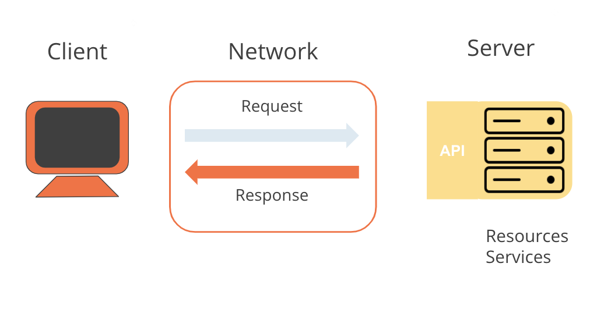
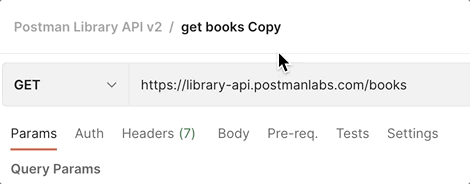
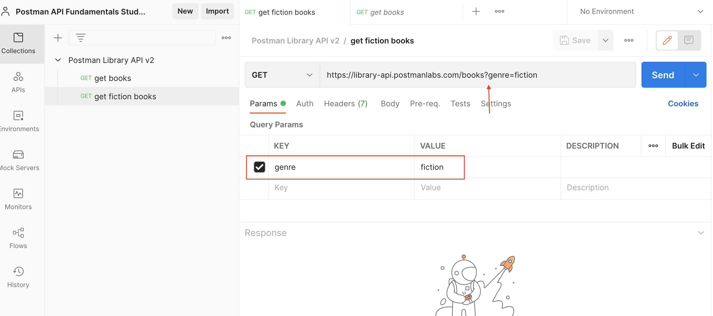
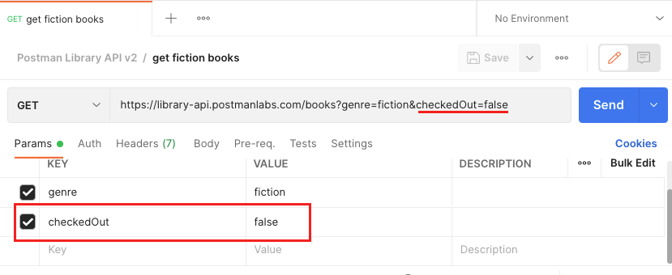
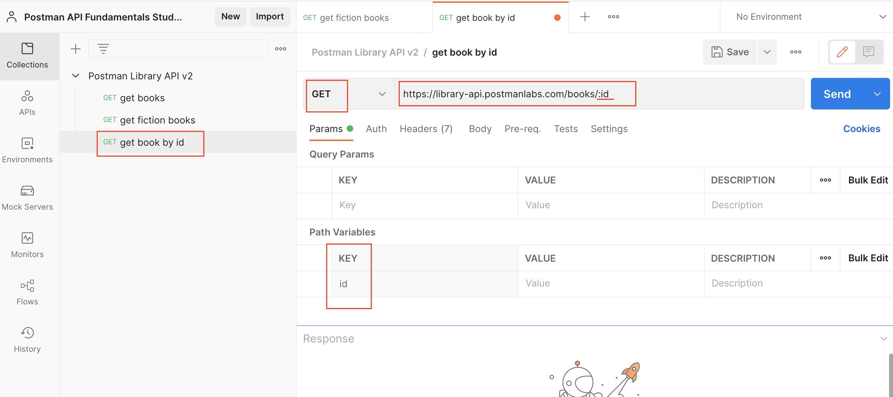
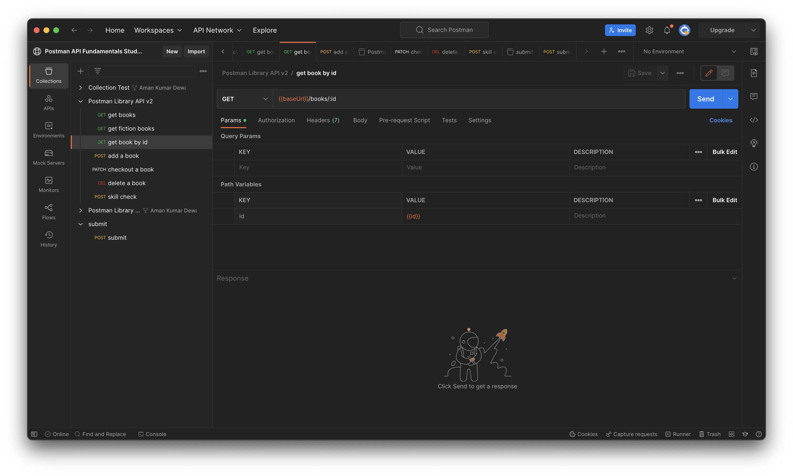

<strong>

# Getting started with Postman

## Creating a Workspace

> This REST API allows you to CRUD (Create, Read, Update, Delete) books in a public library database. You will use Postman to interact with this API and manage books.

- Workspaces dropdown > Create Workspace
 

 

- Name your workspace "Postman API Fundamentals Student Expert" and set the visibility to Public (or Personal if you cannot make a Public workspace on your team). Then click "Create Workspace"
  

  

## Create a Collection

- From the left pane, either click the plus ("+") icon or Create collection.
  

 

- Name your new Collection as "Postman Library API v2".
  

 

## Make your First Request

> Keep in mind all this is a tutorial from Postman Student Program, so you can refer the main documentation as well by enrolling there for free.

> According to the API documentation, you can get all the books in the library by making a request to GET https://library-api.postmanlabs.com/books. Here, GET is the request method and the url is the request URL.

- Create a new request by either clicking Add a request inside your new Collection, or hovering on your Collection, then clicking the three dots icon and "Add request"
  

 

- Name your request "get books". Set the request method to GET, and the request URL to GET https://library-api.postmanlabs.com/books. Be sure to hit Save!
- Send your request by clicking the Send button
- If everything goes well, you will see a response from the server in the lower half of Postman. 

- It should look something like this: a JSON (JavaScript Object Notation) response body that is an array of book objects. You can scroll down to see more books.

  

 

## Request Methods

- When we make an HTTP call to a server, we specify a request method that indicates the type of operation we are about to perform. These are also called HTTP verbs.

<table>
    <tr>
        <th>Method Name</th>
        <th>Operation</th>
    </tr>
    <tr>
        <td>GET</td>
        <td>Retrieve data (Read)</td>
    </tr>
    <tr>
        <td>POST</td>
        <td>Send data (Create)</td>
    </tr>
    <tr>
        <td>PUT/PATCH</td>
        <td>
            Update data (Update)
            * PUT usually replaces an entire resource, whereas PATCH usually is for partial updates
        </td>
    </tr>
    <tr>
        <td>DELETE</td>
        <td>Delete data (Delete)</td>
    </tr>
</table>

 

> Since we are "getting" books and not modifying any data, it makes sense that we are making a GET request. 

## Request URL

In addition to a request method, a request must include a request URL that indicates where to make the API call. A request URL has three parts: a protocol (such as http:// or https://), host (location of the server), and path (route on the server). In REST APIs, the path often points to a reference entity, like "books".

> Paths and full URLs are also sometimes called API endpoints.

## Response Status Codes

> The "Postman Library API v2" has sent back a response status code of "200 OK". Status codes are indicators of whether a request failed or succeeded. Status codes have conventions.

 

<table>
    <tr>
        <th>Code Range</th>
        <th>Meaning</th>
        <th>Example</th>
    </tr>
    <tr>
        <td>2xx</td>
        <td>Success</td>
        <td>
            200 - OK  
            201 - Created  
            204 - No content (silent OK)</td>
    </tr>
    <tr>
        <td>3xx    4xx</td>
        <td>Redirection    Client Error</td>
        <td>
            301 - Moved (path changed)   
            400 - Bad request  
            401 - Unauthorized  
            403 - Not Permitted  
            404 - Not Found</td>
    </tr>
    <tr>
        <td>5xx</td>
        <td>Server Error</td>
        <td>
            500 - Internal server error  
            502 - Bad gateway  
            504 - Gateway timeout</td>
    </tr>
</table>

 

## Request Response Pattern

- Now you can understand the request response pattern, which represents how computers communicate over a network. An API is the interface that lets us know what kind of response to expect when we make certain calls to a server.

You made an HTTP GET request to https://library-api.postmanlabs.com/books and received a response from the server.

  

 

The client is the agent making a request. A client could be a browser or an application you have coded, for example. In our case Postman is the client because that's how we sent the request. 

The request is sent over a network to some server. In our case, we made a request over the public internet to a server located at the address https://library-api.postmanlabs.com. 

The server interpreted the request (GET /books) and sent the appropriate response over the network back to the Postman client: a list of books.

## Query Parameters

- Remember that the minimum ingredients you need to make a request are:

  - a request method (GET/POST/PUT/PATCH/DELETE, etc)
  - a request URL

Some APIs allow you to refine your request further with key-value pairs called query parameters.

Query parameters are added to the end of the path. They start with a question mark ?, followed by the key value pairs in the format: <key>=<value>. For example, this request might fetch all photos that have landscape orientation:

GET https://some-api.com/photos?orientation=landscape

If there are multiple query parameters, each is separated by an ampersand &. Below, two query parameters to specify the orientation and size of photos to be returned:

GET https://some-api.com/photos?orientation=landscape&size=500x400

Let's filter the library catalog to get all the fiction books. We can recycle the first request since we are hitting the same GET /books endpoint.

- In Postman inside the  Postman Library API v2 Collection you made, hover over the "get books" request, click the three dots icon that appears, then select Duplicate to create a copy of the request.

- Rename this second request from the default "get books Copy" to "get fiction books". You can hover on the collection name in the right pane and click the edit icon that appears.

 

-  Using the Params tab, add a query parameter with key genre and value fiction to the "get fiction books" request. Notice how Postman syncs the request URL in real time, adding the question mark ? automatically to mark the start of query parameters!

 

- Save and Send your request.

### Multi Query Parameters

- In the same "get fiction books" request, in the Params tab add a second query parameter with key checkedOut and value false

- Save and Send your request.

## Path Parameters

- Another way of passing request data to an API is via path parameters. A path parameter (or "path variable") is a dynamic section of a path, and is often used for IDs and entity names such as usernames.

### Path parameter syntax

- Path parameters come immediately after a slash in the path. For example, the GitHub API allows you to search for GitHub users by providing a username in the path in place of {username} below: 

> GET https://api.github.com/users/{username}

- Making this API call with a value for {username} will fetch data about that user:

> GET https://api.github.com/users/postmanlabs

- You can have multiple path parameters in a single request, such as this endpoint for getting a user's GitHub code repository:

> GET https://api.github.com/repos/{owner}/{repoName}

- For example, to get information about the newman code repository from postmanlabs:

> GET https://api.github.com/repos/postmanlabs/newman

- Note that some API documentation uses colon syntax to represent a wildcard in the path, like /users/:username, while some use curly braces like /users/{username}. They both mean the same thing: that part of the path is dynamic!

## Get Request by ID

- Hover on your Postman Library API v2 Collection, click the three dots icon and select Add request. Name your new request "get book by id"

 

 

- Make sure the request method is set to GET, and paste in this endpoint as the request URL: https://library-api.postmanlabs.com/books/:id

> Postman automatically adds a "Path Variables" editor in the Params tab of the request for any path parameters in the request URL prefixed with a colon :

 

- Save and Send your request.

</strong>

