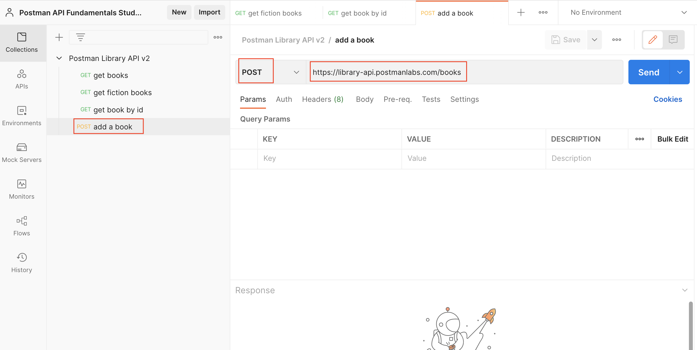
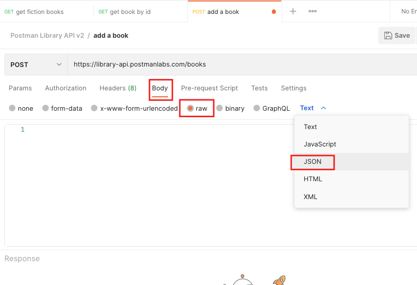
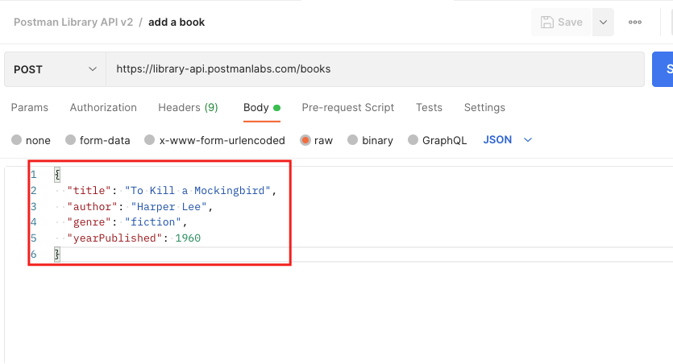
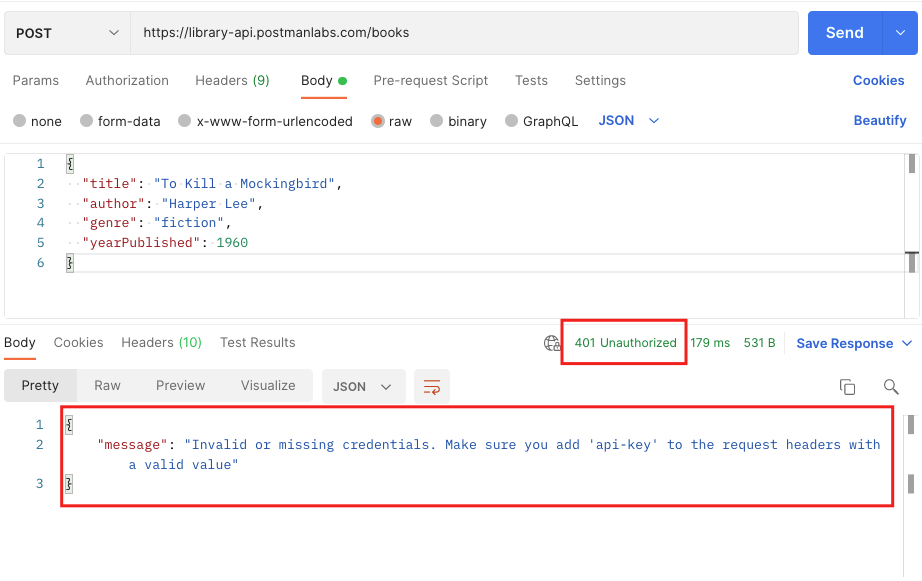
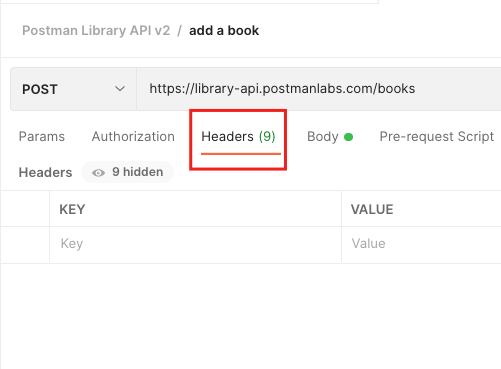
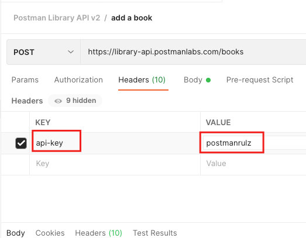
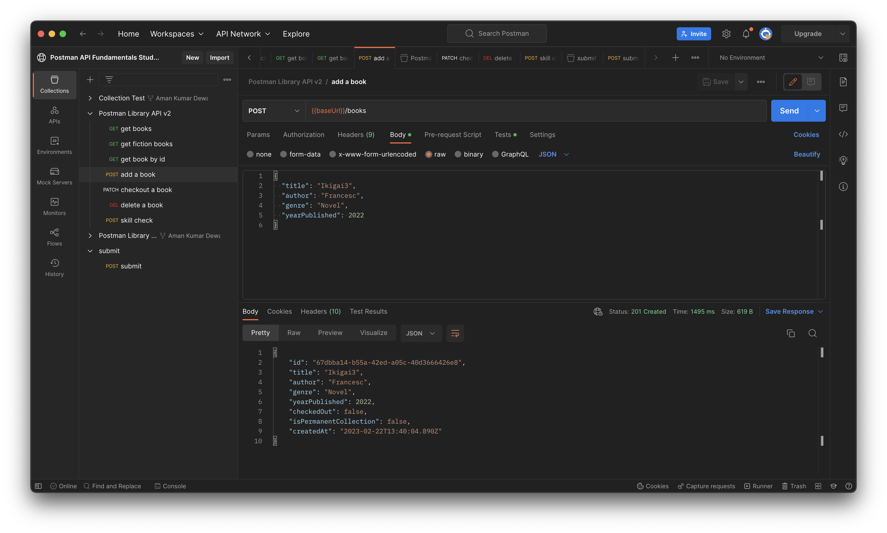
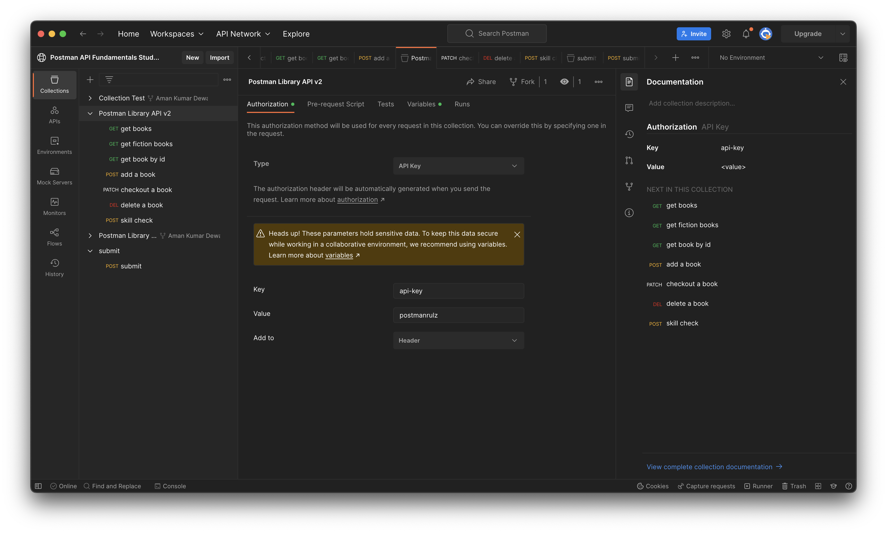

<strong>
<p align="justify">

# Getting Started with Postman `continued...`

<br>


<br>

## Making a POST Request

- Hover over your Postman Library API v2 Collection, click the three dots icon and select Add request. Name you new request "add a book" 

- Set the request method to POST and the request URL to https://library-api.postmanlabs.com/books

<br>



<br>

- This endpoint requires adding a body to our request to send a payload. Our payload will be a JSON object containing the information about the book we are adding.

- Click the Body tab of the request and select that data type raw > JSON

<br>



<br>

- Think of a book you love or have read recently. Inside the Body editor, add a JSON object with details about the new book's title, author, genre and yearPublished. You can copy this object and replace the values with details about your book!

```JSON
    {
        "title": "To Kill a Mockingbird",
        "author": "Harper Lee",
        "genre": "fiction",
        "yearPublished": 1960
    }
```

<br>



<br>

- Save and Send the request.

> The response from the server came back with a status 401 Unauthorized. Remember that 400-level errors are client errors, meaning we made a mistake in our request.

<br>



<br>


## Add an Authourization Header

> Some APIs require Authorization (aka Auth) for certain endpoint in order to permit a request.

### Authourization

- Think about why you might not want an API to have completely open endpoints that anyone can access publicly. It would allow unauthorized people to access data they shouldn't see, or allow bots to flood an API with thousands of calls per second and shut it down. 

There are multiple methods for authorizing a request. Some examples are Basic Auth (username and password), OAuth (password-less authorization), and API Keys (secret strings registered to a developer from an API). 

### Getting an API Key

- APIs that use API Key auth usually allow developers to sign up in a developer portal, where they will receive a random API Key that can be used to authorize their requests to the API. The API Key allows the API to track who is making calls and how often.  

- The Postman Library API v2 uses very light protection and does not require you to register for an API Key. You simply have to know it:

> Header name: api-key<br>Header value: postmanrulz

- As the documentation shows, the Postman Library API v2 requires adding this header to any requests for adding, updating and deleting books, since these operations actually change data in the database as opposed to simply reading them.

### Headers

- Headers are how we can add metadata about our requests, such as authorization information or specify the data type we want to receive in a response. This is different than the actual payload data we send in the body of a request, such as our new book information. 

- You can think of headers like the outside of an envelope when you send a letter. The envelope has information about delivering the letter, like proof that you've paid for postage. The actual data "payload" is the letter inside the envelope.


### Add the API Key to the request header

- On your "add a book" request, click the Headers tab

<br>



<br>

- In the Headers helper table, add the key api-key with a value of postmanrulz

<br>



<br>

- Save and Send the Request.

<br>



<br>

## Using Postman Auth

### Adding Auth to the Collection

> The Postman Auth helper can help you add authorization at the request, folder or collection level.

- Let's add the api-key to our entire collection so that all requests will send the key. 

- Click on your collection "Postman Library API v2" and select the Authorization (or Auth) tab
- Select API Key as the auth Type
- Enter the API Key details in the fields below. Key: api-key, Value: postmanrulz, Add to: Header

<br>



<br>

> Now after adding authorization, when we execute the POST request, it will be successfull with status 201.


</strong>
</p>