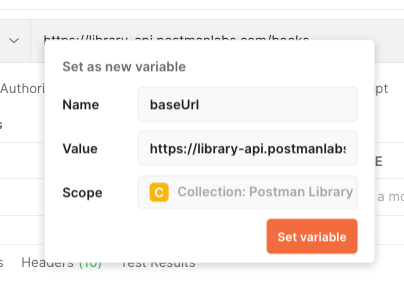
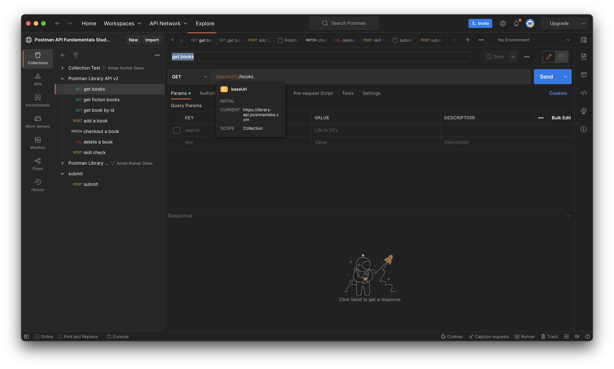
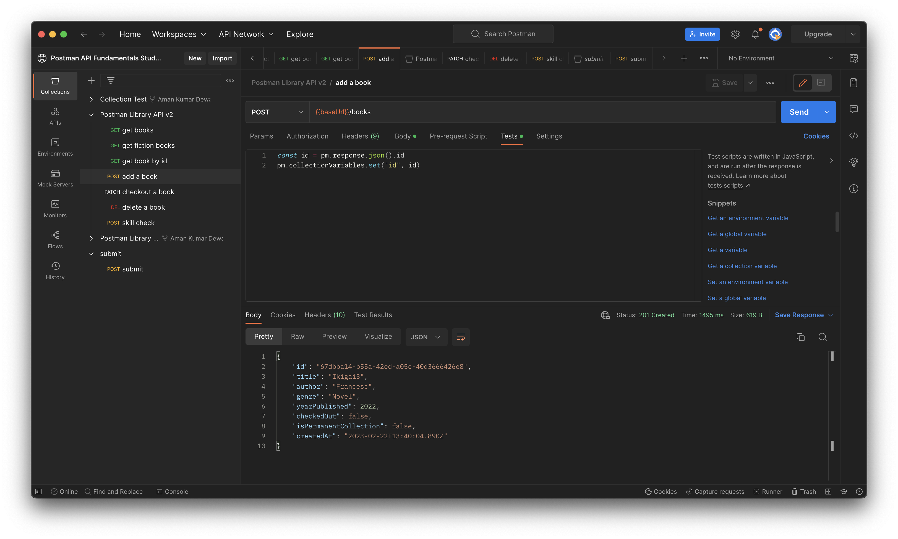
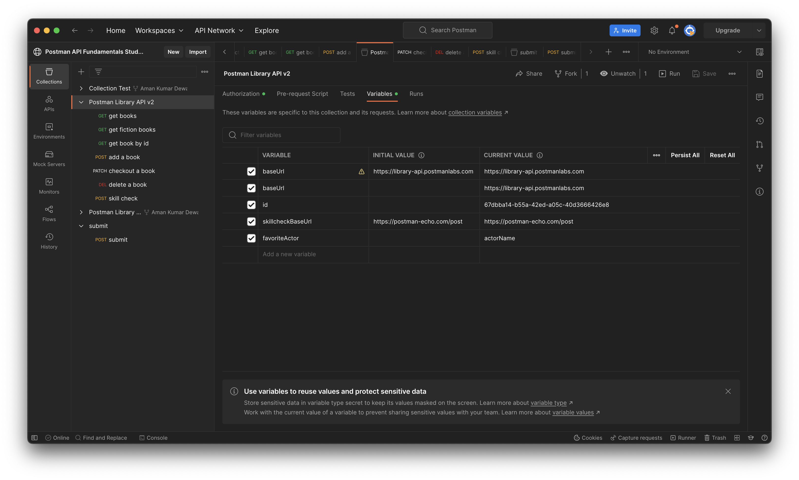

<strong>
<p align="justify">

# Getting started with Postman `continued...`

<br>


<br>

## Variables in Postman

- Postman allows you to save values as variables so that you can:  
  - Reuse values to keep your work DRY (Don’t Repeat Yourself)
  - Hide sensitive values like API keys from being shared publicly

### Variables Scopes

- You can set variables that live at various scopes. Postman will resolve to the value at the nearest and narrowest scope.
- In order from broadest to narrowest, these scopes are: global, collection, environment, data, and local.
- We will work with collection variables today, which are variables that live at the collection level and be can accessed anywhere inside the collection.

### Variables Syntax

- Once a variable is defined, you can access its value using double curly brace syntax like this: {{variableName}}

## Make a `baseUrl` variable

We use the same base URL for all requests to the library API. We can simplify our requests by replacing <https://library-api.postmanlabs.com> with a variable called {{baseUrl}}

- Go to the first "get books" request in your collection.

- With your cursor, select the entire base URL of the API (<https://library-api.postmanlabs.com>). Do not include the slash / after .com.

- Click Set as variable to save the base URL to a variable.

<br>


<br>

- Click Set as a new variable

<br>


<br>

- Name your new variable “baseUrl” and select “Collection” as the scope, then click Set variable.

<br>



<br>

> Now that the variable is set, you can access the value anywhere in your collection by typing {{baseUrl}}

- Hover over {{baseUrl}}. You will see its current value is set to <https://library-api.postmanlabs.com>

<br>



<br>

## Setting variables Programmatically

- Postman gives you the ability to add automations and dynamic behaviors to your collections with scripting.
- Any Node.js code in the Tests tab of a request will be executed after a response comes back from the API.

### The `pm` Object

- Postman has a helper object named pm that gives you access data about your postman environment, requests, responses, variables and testing utilities.
- For example, you can access the JSON response body from the API with:

    ```JavaScript
    pm.response.json();
    ```

- You can also programmatically get collection variables like the value of baseUrl with:

    ```JavaScript
    pm.collectionVariables.get(“baseUrl”);
    ```

> In addition to getting variables you can also set them with pm.collectionVariables.set("variableName", "variableValue") like this: pm.collectionVariables.set(“myVar”, “foo”)

## Writing your First Script

- In your "add a book" request, change the book data in your Body to a new book you like.
- Open the Tests tab of the request

<br>



<br>

- Inside the Tests editor, add this JavaScript code to log the JSON response from the API:

    ```JavaScript
    console.log(pm.response.json())
    ```

- Save and Send your request.
- Open the Postman Console in the lower left of the window
- Scroll to the bottom of the logs in the console. You will see your most recent request POST <https://library-api.poistmanlabs.com/books>.

### Setting and getting Collection Variables

- The pm object allows you to set and get collection variables.

- To set a collection variable use the .set() method with two parameters: the variable name and the variable value

    ```JavaScript
    pm.collectionVariables.set("variableName", value)
    ```

- To get a collection variable use the .get() method and specify the name of the variable you want to retrieve:

    ```JavaScript
    pm.collectionVariables.get("variableName")
    ```

### Local variables

- We can also store local variables inside our Tests script using JavaScript. 

- There are two ways to define a variable in JavaScript: using the const or let keywords. const is for variables that won't change value, whereas let allows you to reassign the value later.

### Set the New Book ID as variable

- In the Body tab of the "add a book" request, change the details to yet another new book to add!
- In the Tests tab of the "add a book" request, replace the console.log() statement with this code:

    ```JavaScript
    const id = pm.response.json().id
    pm.collectionVariables.set("id", id)
    ```

- First we assign the id value from our API response to a local const variable named id (we use const because this value doesn't change in our script). The second line sets this value to a collection variable called id.
- Save and Send the request.

> When the 201 response comes back from the API with you newly created book, the Tests script will run and save the book's id as a collection variable automatically.

- View your collection variables by clicking on your Postman Library API v2 collection, then the Variables tab.

<br>



<br>

> The id variable has been automatically assigned the id of your new book as its Current Value!

</strong>
</p>
