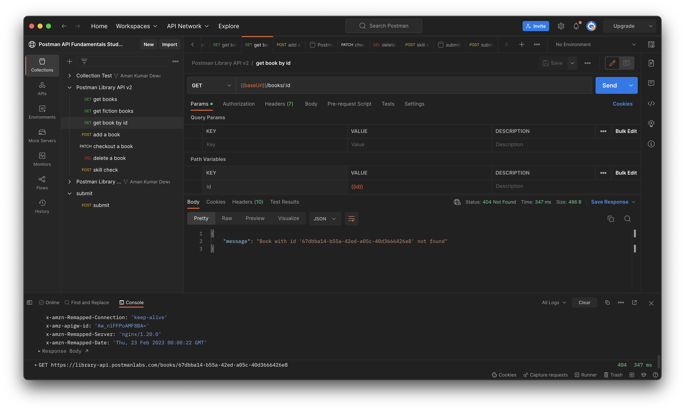

<strong>
<p align="justify">

# Getting started with Postman `continued...`

> The API documentation shows we can update a book by id by making a request (authorized with the API Key) with the updated information to: PATCH <https://library-api.postmanlabs.com/books/:id>

## Request to Update

- Hover on your Postman Library API v2 collection, click the three dots, and select Add  request. Name your new request "checkout a book"
- Set the request method to PATCH and the request URL to {{baseUrl}}/books/:id

<br>


<br>

- Set the value of path variable id to {{id}}.

> This will use the value of our collection variable named id that was set in the script of the"add a book" request

<br>


<br>

- Add a raw JSON body in the Body tab for updating the checkedOut property to true:

    ```JavaScript
        { 
        "checkedOut": true 
        }
    ```

<br>


<br>

- Make sure in the Authorization (Auth) tab that the Auth type is set to "Inherit from parent". This will use the API Key set at the collection level on our PATCH request.
- Save and Send the request.

## Delete the record

> The DELETE request has a similar format to the PATCH request, so let's copy the PATCH request to make our new request.

- Hover over your "checkout a book" requet, click the three dots icon, then select Duplicate to create a copy of the request. Rename your new request "delete a book"
- Set the request method of the "delete a book" request to DELETE 
- Make sure the request Body is empty. This endpoint does not require a body.
- In the Params tab, make sure the path variable id is set to {{id}}

<br>


<br>

- Save and Send the request.

<br>


<br>
  
> You should get a 204 No Content response from the API. This means the server successfully deleted the book, and won't send any response body back. Remember: if you ever wonder what a status code means, you can hover on it in Postman for an explanation!

<br>



<br>

</p>
</strong>
