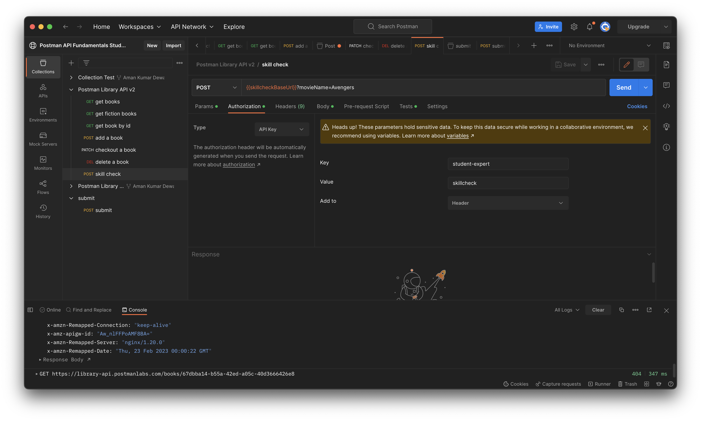

<strong>

# Test Solution

- Set the `skillcheckBaseUrl` variable as shown below:
 

 

- Set the query parameter as shown below:
 

 

- Set the authourization as given below:
 

 

- Set the Body to `raw` type and use `JSON` format.
 

 

- Set the variable `favoriteActor` with the value of variable `actorName`.
 

 

- Save and Submit the request.

</strong>